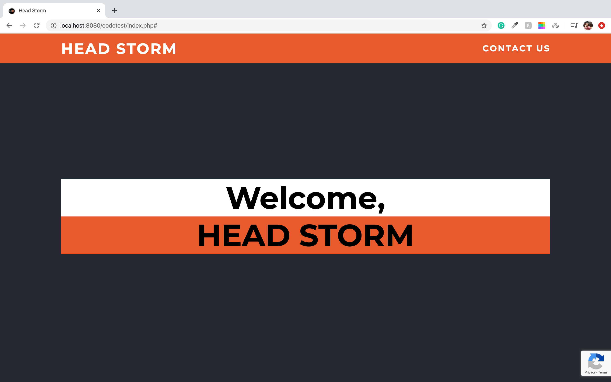
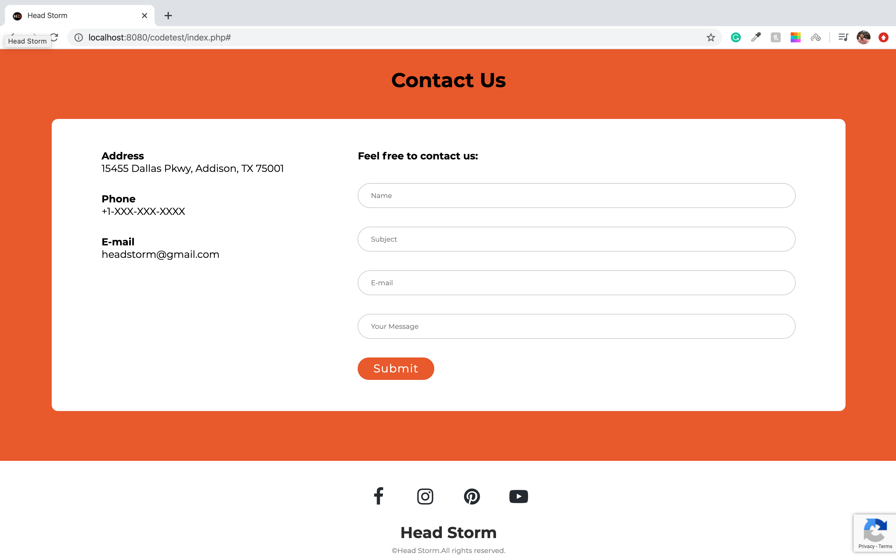

# HeadStorm-Front-end-challenge
Here is the solution of 1st front end coding challenge for Headstorm

Site link:https://www.headstorm.com/challenge/

Github Link:https://github.com/Headstorm/Interview/blob/master/challenges/README.md

So I have create a single page(index.php) website which includes both home and contact form. I have created my own css i.e main.css
and the weboage is responsive. For the form I have created a validation.js file which is invoked before submission of the form 
to check the requirements based on the form elements. It checks every element is valid or not. To add validation such as require simply
add required class to the element same goes to verify valid email string or not. I have also used 3rd person scroll.js it is to
add scrolling animation when clicked on contact link in the navigation bar.

### Solution Screenshots of the work:

